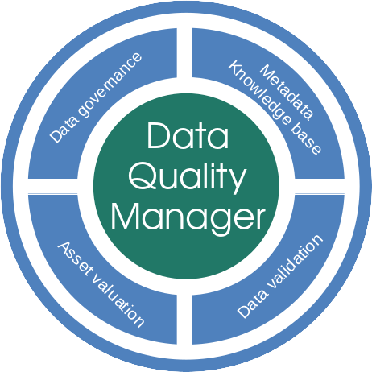

# Data Quality Manager metadata knowledge base

Data Quality Manager is an intranet application dedicated to data quality assessment, driven by metadata knowledge. 

The portal is organised in 4 areas of expertise:

 * The knowledge - define, acquire, deploy harmonised metadata to master your key data
 * The data validation - enforce consistency and ensure data are relevant regarding your business rules
 * The assessment - calculate the value of your data assets and assess the Total Cost of Ownership of your data
 * The governance - define your objectives and strategy to reach the golden data asset, monitor activities and assets.

## Technical layer
 * Ruby 2.7
 * Rails 5.2
 * Postgresql 12
 * JQuery
 * Bootsrap / MaterialDesign

## Avaibility
 * On premise installation
 * Docker image

## LICENSE
    Copyright (C) 2022  Frédéric Champreux

    This program is free software: you can redistribute it and/or modify
    it under the terms of the GNU General Public License as published by
    the Free Software Foundation, either version 3 of the License, or
    (at your option) any later version.

    This program is distributed in the hope that it will be useful,
    but WITHOUT ANY WARRANTY; without even the implied warranty of
    MERCHANTABILITY or FITNESS FOR A PARTICULAR PURPOSE.  See the
    GNU General Public License for more details.

    You should have received a copy of the GNU General Public License
    along with this program.  If not, see <https://www.gnu.org/licenses/>.
